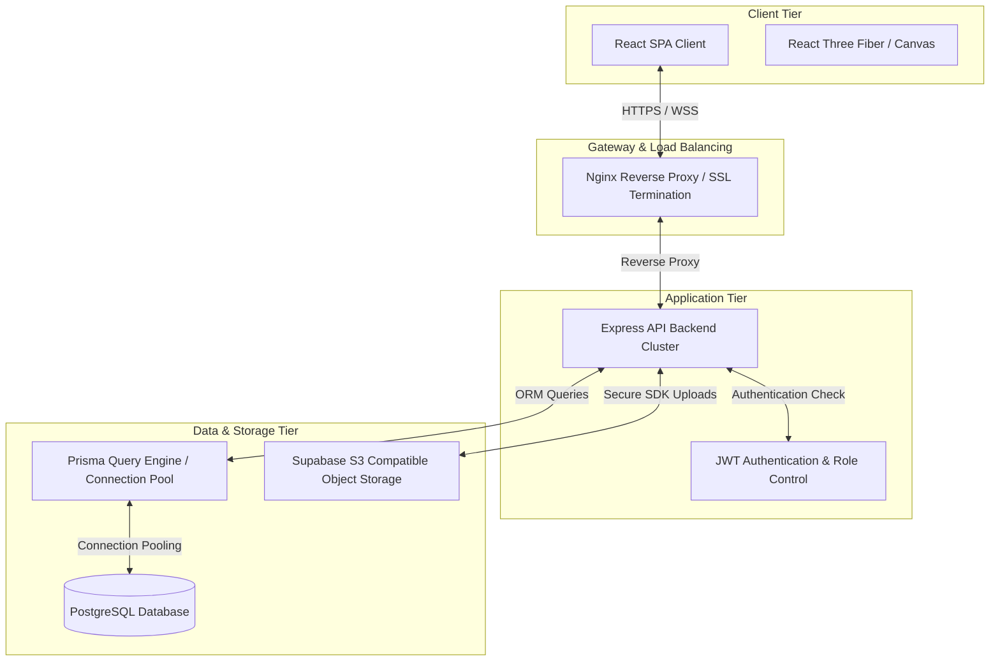
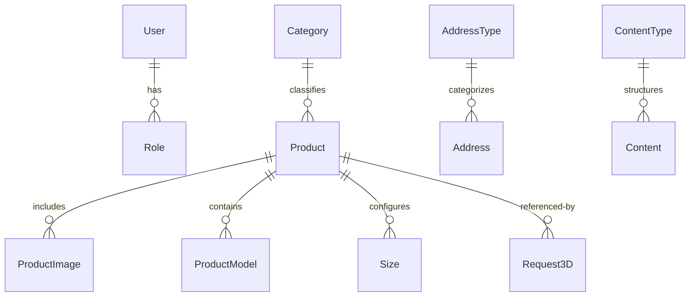

# Kakuta USA - Enterprise System Documentation

This repository houses the **Kakuta USA** Enterprise Catalog & 3D Visualization System. Designed to serve as a robust, scalable, and secure application, it integrates modern 3D rendering capabilities with an enterprise-grade backend infrastructure.

---

## 1. Enterprise System Architecture

The Kakuta USA system follows standard multi-tiered enterprise architecture patterns, designed for high availability, security, and scalability.



### Architectural Highlights
* **Decoupled Architecture**: Complete separation of frontend (SPA) and backend (REST API) allows independent scaling, deployment, and localized technology upgrades.
* **Database Connection Pooling**: Prisma Client is optimized for environment-specific connection pooling to manage concurrent queries under heavy traffic.
* **Object Storage Separation**: Static assets and binary files (CAD models, WebGL models `.gltf`/`.bin`/`.step`) are hosted externally via Supabase Object Storage to reduce load on the primary application servers.
* **Docker-Orchestrated Services**: Docker Compose isolates environments (`dev`, `prod`) ensuring consistency between developer machines and staging/production clouds.

---

## 2. Enterprise Standards & Security Policies

To support enterprise operations, the system enforces the following security and design patterns:

### A. Security Standards (OWASP Top 10 Mitigation)
* **Secure CORS Configuration**: Restricted origin validation implemented in the API router, ensuring cross-origin requests are only accepted from authorized company domains.
* **HTTP Security Headers**: Integrated `helmet` middleware to set critical security headers (Content Security Policy, X-Frame-Options, Strict-Transport-Security, etc.) preventing Clickjacking and XSS attacks.
* **Rate Limiting (DoS Prevention)**: Dual rate limiters implemented:
  * *General API Limiter*: Caps general requests to protect system resource limits.
  * *Authentication Limiter*: Enforces strict rate limits on login and email submission endpoints to block brute-force attempts.
* **Input Sanitization & Type Validation**: Explicit type parsing and constraints mapping (e.g., verifying address identifiers, email formats) before database insertion.

### B. Deployment & Infrastructure
* **SSL/TLS Termination**: Handled at the gateway/proxy tier (Nginx or CDN provider).
* **Docker Target Builds**: The Docker configurations utilize multi-stage builds (`dev` and `prod` targets) to ensure production containers exclude developer dependencies, resulting in smaller, more secure container footprints.

---

## 3. Technology Stack

### Frontend (Client Tier)
* **Core Framework**: React 19 (Modern component lifecycle, optimized rendering)
* **Build Engine**: Vite 7 (High-performance module bundling)
* **CSS Engine**: Tailwind CSS v4 (Utility-first styling) & DaisyUI v5
* **State Management & Fetching**: TanStack React Query v5 (Optimized caching, automatic background refetching)
* **3D Visualizer**: `@react-three/fiber` & `@react-three/drei` (WebGL/Three.js rendering for GLTF CAD catalogs)
* **API Client**: Axios (configured with interceptors for JWT injection)

### Backend (Application Tier)
* **Runtime**: Node.js (Long-Term Support version recommended)
* **Framework**: Express v5 (Stable REST routing engine)
* **Database Client**: Prisma Client v6
* **Authentication**: JWT (JSON Web Tokens) with secure cookie-parser utility
* **Mailer Service**: Nodemailer (Transactional emails for 3D requests)
* **API Documentation**: Swagger UI (OpenAPI specification)

### Database & Storage (Data Tier)
* **Database Engine**: PostgreSQL 15 (Enterprise relational database)
* **Asset Storage**: Supabase S3-Compatible Storage (high throughput asset delivery)

---

## 4. Repository & Directory Structure

An organized, layered folder hierarchy separates client code, business services, and database schemas:

```text
kakutausa/
├── backend/                       # Express REST API
│   ├── prisma/                    # Database migrations & schemas
│   │   ├── migrations/            # SQL Schema Migration History
│   │   ├── schema.prisma          # Database Models & Relations
│   │   └── seed.js                # Core seed script (inserts admin & baseline data)
│   ├── src/
│   │   ├── config/                # Service configurations (db, swagger)
│   │   ├── controllers/           # HTTP Request Controllers
│   │   ├── middlewares/           # JWT Authentication & Admin-only middlewares
│   │   ├── routes/                # API Route Registry
│   │   ├── utils/                 # Cryptography, File Storage, Mailers
│   │   └── server.js              # Server bootstrapper
│   ├── Dockerfile                 # Multi-stage API Dockerfile
│   └── package.json
├── frontend/                      # React SPA Client
│   ├── public/                    # Static UI resources
│   ├── src/
│   │   ├── components/            # Reusable UI widgets & 3D Canvas visualizers
│   │   ├── pages/                 # Full view layouts (Catalog, Product detail, Forms)
│   │   ├── utils/                 # HTTP client instances & helpers
│   │   └── main.jsx               # Client entrypoint
│   ├── Dockerfile                 # Multi-stage Client Dockerfile
│   ├── vite.config.js             # Vite build settings
│   └── package.json
├── docker-compose.yml             # Development orchestrator (hot-reloading)
└── docker-compose.prod.yml        # Production-ready orchestrator
```

---

## 5. Enterprise Schema Overview (Prisma Models)

The data model is normalized to handle standard catalog operations:



* **User & Roles**: Handles corporate access control (`ADMIN` vs `USER`).
* **Product Catalog**: Handles nested catalog queries mapping `Product`, `Category`, `ProductImage`, and `ProductModel` (coordinates CAD assets like `.gltf`, `.bin`, `.step` for downstream distribution).
* **Technical Sizes**: Detailed engineering schemas detailing weights, sizes, and tolerance movements in both metric and imperial metrics.
* **Corporate Resources**: Supports content internationalization (`Content` & `ContentType`) and dynamic branch offices (`Address` & `AddressType`).

---

## 6. Deployment & Environment Setup

### Local Enterprise Environment
Create the backend `.env` configuration mapping the database, storage, and security credentials:

```ini
# Database Connection
DATABASE_URL="postgresql://user:password@db:5432/kakutausa?schema=public"

# Security
JWT_SECRET="your-enterprise-jwt-secret-key"

# Mail Config
EMAIL_HOST="smtp.mailtrap.io"
EMAIL_PORT=2525
EMAIL_USER="your-smtp-username"
EMAIL_PASS="your-smtp-password"

# Supabase Storage Credentials
SUPABASE_URL="https://your-supabase-project.supabase.co"
SUPABASE_KEY="your-supabase-anon-key"
```

Start the multi-container stack in development mode:
```bash
docker-compose up --build
```

### Production Deployment
In production, compile the application using optimized production configurations:
```bash
docker-compose -f docker-compose.prod.yml up --build -d
```
This target ensures:
* React is built into static HTML/CSS/JS served via Nginx.
* Node.js executes in `production` mode with debug logs deactivated.
* All development directories and hot-reloading watchers are removed for security.
