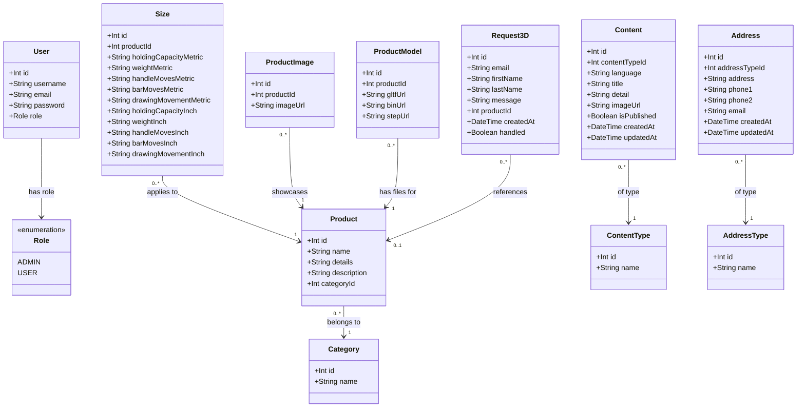
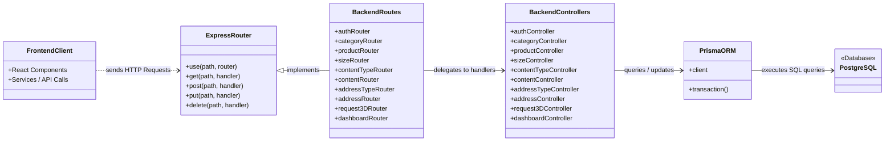

# System Class & Data Model Diagrams

This document details the object model, domain entities, and structural architecture of the **Kakutausa** project.

---

## 1. Domain Entity & Database Class Diagram

This diagram displays the database entities, their properties (with types), and their relationships as defined in [schema.prisma](./backend/prisma/schema.prisma).

---

## 2. Architectural MVC Dependency Diagram

The system follows a classic Router-Controller-Service pattern where Node/Express routes request parameters to Controller functions, which interact with the database via Prisma and return results to the React frontend.

